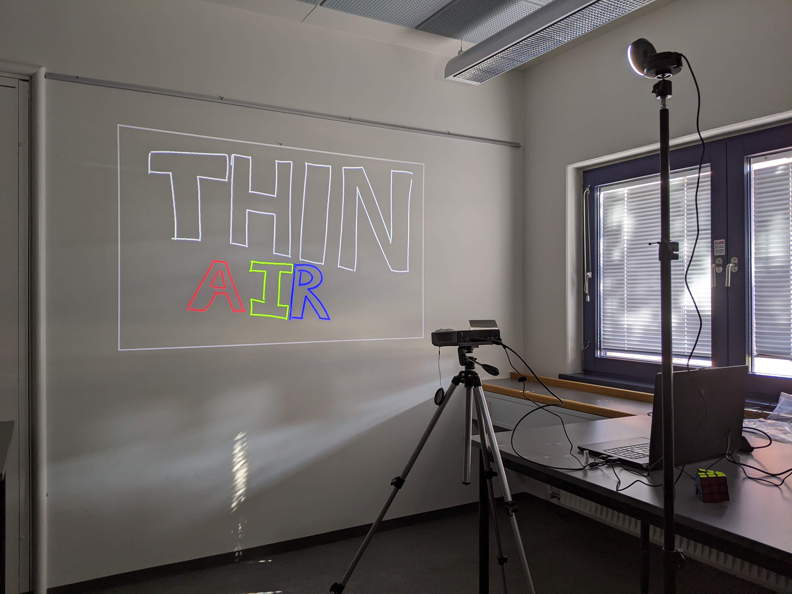

# ThinAir
ThinAir is a software implementation allowing virtually any combination of a webcam and projector (or screen) to act as a digital whiteboard. It utilizes MediaPipe to track the user's hand, and translates specific hand poses to actions in the system, such as drawing by extending the index finger, and opening the tool/color menu by making a fist.

ThinAir has been produced as an undergraduate project at Aalborg University, Denmark.



## Supported Hardware and OS
The system has been tested with various combinations of projectors, webcams, and operating systems. The following is a list of components that have been officially tested and have been determined to be fully supported, although we assume that it will work with essentially any combination of projector, webcam, and OS as long as these are compatible with each other.

**Projectors and Screens:**
 - ASUS P3E DLP-projector
 - A Samsung TV

**Webcams:**
 - Razer Kiyo
 - Gearlab G640 HD
 - Logitech V-U0018

**Operating Systems:**
 - Windows 10
 - Ubuntu 20.04

## Production
If ThinAir is to be used in a production setting, the following setup and usage instructions apply.
### Setup
ThinAir has been tested and works with Python 3.9. To use the software, first, install the requirements:
```
pip install -r requirements.txt
```

Then, ThinAir can be run with:
```
py main.py
```

### Usage
When ThinAir is run, there is a few keyboard shortcuts, which hold significance:
 - s: opens the settings menu, and writes the chosen configuration to `config.json`
 - t: saves the current drawing to `drawing.json`, which is loaded upon startup

To calibrate the camera, make sure the entire projected surface or screen is within view, and left-click on each of the four corners. A blue square should now highlight the projected area. If this is not the case, left-click once to reset the calibration, and try again.

You can now use your hand to draw on the projected surface.

#### Hand Poses
| **Name**     | **Pose**                                            | **Functionality**                                  |
|--------------|-----------------------------------------------------|----------------------------------------------------|
| Current Tool | Extend index finger, retract all other fingers      | Uses the currently selected tool (drawing/erasing) |
| Tool Menu    | Make a fist, and move your hand to the desired tool | Opens the tool/color menu                          |

## Development
For further development on ThinAir, there's a few important details highlighted here.

### Project Structure
The project is mostly divided into packages containing classes following OOP principles. The following table is an overview of the purpose of each package.

| **Package Name**     | **Purpose**                                                                                                        |
|----------------------|--------------------------------------------------------------------------------------------------------------------|
| bezier               | Contains the Cython implementation of Bezier curve smoothing.                                                      |
| hand_pose_recognizer | Contains the trained model for recognizing the supported hand poses.                                               |
| menu_wheel           | Contains classes relevant to the menu wheel, as well as image resources.                                           |
| model                | Contains model classes related to drawing, such as the Canvas, Camera, and Hand.                                   |
| persistence          | Contains classes related to writing to disk and general persistence for configuration settings and saved drawings. |
| tests                | Contains all test cases for the project.                                                                           |
| utility              | Contains classes and functions that do not fit elsewhere and contain useful project-wide functionality.            |

### Cython and setup.py
Cython is used to increase performance of the Bezier curve smoothing used on line segments in ThinAir. Everything related to this can be found in the `bezier` package. If one were to change the implementation of `bezier.pyx` it is important to recompile it afterwards.
This can be done using the following command:
```
python setup.py build_ext
```

This will generate a `build` folder, which contains the appropriate compiled `.pyd` (Windows) or `.so` (Linux) file. To utilize this in the project, overwrite the existing `.pyd` or `.so` file in the `bezier` package with this newly compiled file.

### Hand Pose Recognition Model
The `hand_pose_recognizer` package contains our trained model for recognizing the supported hand poses. For this training, we have utilized the following project: [Hand Gesture Recognition using MediaPipe](https://github.com/Kazuhito00/hand-gesture-recognition-using-mediapipe).
If one wishes to extend or change the supported hand poses, we recommend also utilizing said repository.
